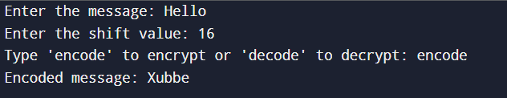
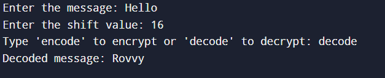
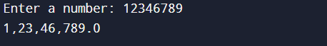
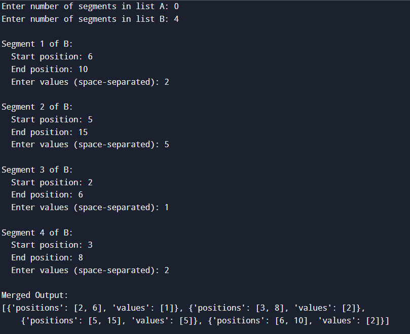
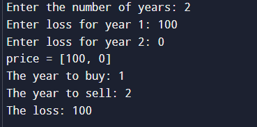

# 🔐2.1_Caesar Cipher Encoder/Decoder

A simple Python implementation of the **Caesar Cipher**, one of the most well-known classical encryption techniques. This program allows you to **encode** or **decode** messages using a customizable shift value.

---

## 📜 About

The **Caesar Cipher** is a type of substitution cipher in which each letter in the plaintext is shifted a fixed number of positions down or up the alphabet.

For example, with a shift of `3`:
- **Plaintext**: `HELLO`
- **Ciphertext**: `KHOOR`

This tool allows encoding and decoding with both **uppercase** and **lowercase** letters, preserving non-alphabetic characters like punctuation and spaces.

---

## 🛠️ Features

- ✅ Encode a message with a given shift
- ✅ Decode a message with the same shift
- ✅ Handles both upper and lower case letters
- ✅ Ignores and preserves spaces, numbers, and symbols

---

## 📷 Screenshots

### 🧾 Encoding a Message

### 🗝️ Decoding a Message

---  END  ---

# 💰2.2_Indian Currency Formatter

This is a simple Python program that formats any floating-point number into the Indian numbering format, inserting commas at the correct positions (Lakhs, Crores, etc.).

---

## 📜 Problem Statement

In the Indian numbering system, large numbers are grouped differently compared to the Western system. This project takes a floating point number as input and converts it into a **comma-separated Indian currency format**:

- Thousand → 1,000  
- Lakh → 1,00,000  
- Crore → 1,00,00,000  

---

## 🛠️ Features

- ✅ Accepts user input (float)
- ✅ Formats integer part with Indian grouping (3-2-2 pattern)
- ✅ Preserves decimal places
- ✅ Returns a properly formatted string

---

## 📷 Screenshots

### 📈 Output Example

---  END ---

# 🔗2.3_Combining Two Lists by Overlapping Positions

This Python program merges two lists of elements, each element defined by a range of positions and associated values. The merge combines elements whose position intervals overlap by more than half, preserving the position of the element that appears first.

---

## 📜 Problem Statement

Given two lists of elements where each element is structured as:

## 🛠️ Features

- ✅ Takes user input for two lists with multiple position-value segments.
- ✅ Detects overlapping intervals using a threshold (>50% overlap).
- ✅ Merges values of overlapping elements intelligently.
- ✅ Maintains order based on left position.
- ✅ Prints the merged list of elements clearly.

## 📷 Screenshots

### 📈 Output Example

---  END  ---

# 💸2.4_Minimizing Loss

Rajeev has a list of **projected house prices** over several years. He must **buy the house in one year and sell it in another**, **incurring a loss**. This program helps him find the **minimum financial loss** possible under those conditions.

---

## 🧠 Problem Statement

Given a list of distinct house prices per year, identify:
- The year to **buy** the house
- The year to **sell** the house
- The **minimum possible loss** Rajeev would incur (i.e., smallest difference between a higher buy price and a lower sell price)

The constraint:  
He must **buy before selling**, and it must result in a **loss**.

---

## ✨ Features

- 📥 Accepts user-defined input: number of years and prices.
- 🔍 Finds **only loss-incurring** transactions.
- 📉 Outputs the **minimum loss** scenario.
- 📅 Returns the **exact years** to buy and sell.
- ✅ Handles all valid distinct price inputs.

---

## 📷 Screenshots

### 📈 Output Example

---  END  ---

